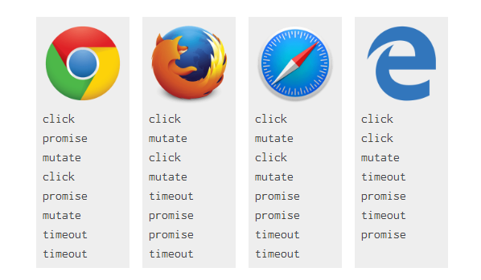

### 宏任务和微任务

[原文链接](https://jakearchibald.com/2015/tasks-microtasks-queues-and-schedules/)

（译者：第一段是废话，不译）

如果你更喜欢看视频的话，这里有[Philip Roberts](https://twitter.com/philip_roberts)讲述的一个[视频](https://vimeo.com/96425312)----视频里并没有讲微任务，但对宏任务、队列和调度进行了很棒的介绍。好了，话不多说，开始我们的旅程...

先看一段小代码：

```javascript
console.log('script start');

setTimeout(function() {
  console.log('setTimeout')
}, 0);

Promise.resolve().then(function(){
  console.log('promise1');
}).then(function() {
  console.log('promise2');
})

console.log('script end');
```

#### 上面代码执行的结果输出顺序是什么？

正确答案是：`script start`,`script end`,`promise1`,`promise2`,`setTimeout`。

事实不同浏览器有不同的结果。Edge，Firefox 40， iOS Safari和desktop Safari 8.0.8输出的结果中，`setTimeout`先于`promise1`和`promise2`输出，而在Firefox 39和Safari 8.0.7中输出结果又是正常的。

#### 为什么是这样的？

要知道为什么首先要知道事件循环（event loop）是如何处理宏任务和微任务的。如果你是第一次知道这些概念，那么你可能会觉得有些难以理解，不过别怕，深呼吸，发车。。。。

每个进程都有自己的“事件循环”，包括web worker在内也是，所以它们可以独立运行。在同一个页面中的程序共享着同一个事件循环，它们因此能够同步的进行交流。事件循环持续的运行，不断执行存在于任务队列中的任务。一个事件循环有多个任务源，一个任务源就是包含多个任务的列表，根据列表中任务的顺序，来调度任务。对于浏览器来讲，浏览器需要决定每次循环时任务从哪个任务源中取，这使得浏览器能够给予视觉敏感的任务一些优先权，比如用户输入。好，各位跟紧了。。。

宏任务可以被调度，所以浏览器可以把宏任务按照一定的顺序的放到js作用域或者DOM中去执行。在执行任务中间，浏览器可能会去更新页面。从鼠标点击到事件回调被执行，这需要一个宏任务来完成，比如渲染HTML，或者上面例子中的`setTimeout`。

`setTimeout`会等待一个延迟时间，然后再去调度包含它回调的宏任务来执行。所以上面例子中，`setTimeout`会比`script end`后输出。`script end`的输出与`setTimeout`回调的执行不属于同一任务。

微任务（microtasks）通常指那些应当在当前执行的脚本执行完毕后（当js执行栈为空时）执行的任务，比如一系列动作的响应，或者没有副作用的异步回调。在宏任务执行结束，没有其他js代码在执行时，微任务队列中的任务就会被处理。在微任务处理过程中加入的其他微任务会被放到队列尾部，并且也会一起被处理。微任务包括 mutaion observer回调（MutaionObserver用来观察节点的变化的），还有比如上面例子中的promise回调。

一个promise被创建后，就会为自己的回调设置一个微任务放到微任务队列中，这确保了它的回调是被异步执行的。所以在一个promise后面调用`.then(yey,nay)`会立即向微任务队列中添加一个微任务。因为微任务必须等到当前执行中的宏任务执行完毕才能被执行，所以`promise1`和`promise2`会晚于`script end`输出。又因为微任务总是先于下一个宏任务执行，所以`promise1`和`promise2`又先于`setTimeout`输出。

所以：

```javascript
//这一整段代码是一个宏任务
console.log('script start');

setTimeout(function() {
  console.log('setTimeout');	// 产生一个新的宏任务放到宏任务队列
}, 0);

Promise.resolve().then(function() {
  console.log('promise1');	//产生一个新的微任务放到微任务队列
}).then(function() {
  console.log('promise2');	// 产生另一个微任务并被放到微任务队列
});

/*
 当前宏任务执行完之后就会去检查微任务队列并执行微任务，微任务队列执行空了之后，再去执行下一个宏任务
*/
```

#### 为什么有些浏览器表现的不一样？

有些浏览器输出日志是这样的`script start`，`script end`，`setTimeout`，`promise1`，`promise2`。这些浏览器会在`setTimeout`之后执行promise的回调，看起来像是它们把promise回调作为了一个宏任务处理而不是微任务。

promise被当成宏任务也有情可原，毕竟promise来自于ECMAScript而不是HTML。ECMAScript规范中有'Job'的概念，和微任务有点类似，但两者的关系并不明朗，在[这里](https://esdiscuss.org/topic/the-initialization-steps-for-web-browsers#content-16)有一些讨论。但是通常情况下，把promise当成微任务来处理还是更加妥当的。

把promise当成宏任务处理会引起一些问题。例如，回调会被宏任务结束后的页面渲染或其他事情推迟，也会因为和其他宏任务源的交互产生执行上的不确定性，又或者会影响其他API的调用，等等。

这里有个Edge中把promise当成微任务处理的[投票](https://connect.microsoft.com/IE/feedback/details/1658365)，Webkit正在做正确的事情，所以我觉得Safari最终也会修改已有的执行机制。而且在Firefox43中这已经是被修复了的。

#### 如何分辨一个任务是宏任务还是微任务

实际测试是一种办法。看日志输出相对promise和`setTimeout`的位置，前提是你所依赖的实现是正确的。

另一个方法是查规范。例如，[这里](https://html.spec.whatwg.org/multipage/webappapis.html#event-loops)提到了`setTimeout`是一个宏任务，而在[这里](https://dom.spec.whatwg.org/#queue-a-mutation-record)提到了mutation会产生一个微任务。

在ECMAScript中，微任务被称作'Job'。[这里](http://www.ecma-international.org/ecma-262/6.0/#sec-performpromisethen)提到，`PerformPromiseThen`、`EnqueJob`都会产生一个微任务。

下面我们看一些更复杂的例子。。。

### Level1神仙打架

页面上有下面这么个结构

```HTML
<div class="outer">
  <div class="inner"></div>
</div>
```

Js代码如下，当点击页面元素时，控制台会如何输出？

```javascript
// Let's get hold of those elements
var outer = document.querySelector('.outer');
var inner = document.querySelector('.inner');

// Let's listen for attribute changes on the
// outer element
new MutationObserver(function() {
  console.log('mutate');
}).observe(outer, {
  attributes: true
});

// Here's a click listener…
function onClick() {
  console.log('click');

  setTimeout(function() {
    console.log('timeout');
  }, 0);

  Promise.resolve().then(function() {
    console.log('promise');
  });

  outer.setAttribute('data-random', Math.random());
}

// …which we'll attach to both elements
inner.addEventListener('click', onClick);
outer.addEventListener('click', onClick);
```

（译者：原文[这里](https://jakearchibald.com/2015/tasks-microtasks-queues-and-schedules/)有例子，我就不放了）

点击内层的方格后控制台输出如下日志：

```log
click
promise
mutate
click
promise
mutate
timeout
timeout
```

你猜的没错，不同浏览器日志输出顺序有些不同：



#### 那谁是正确的？

触发一个点击事件是一个宏任务，mutation observer和promise回调是微任务，`setTimeout`回调是宏任务，所以代码执行顺序如下：

```javascript
// Let's get hold of those elements
var outer = document.querySelector('.outer');
var inner = document.querySelector('.inner');

// Let's listen for attribute changes on the
// outer element
new MutationObserver(function() {
  console.log('mutate');
}).observe(outer, {
  attributes: true
});

// Here's a click listener…
//先明确一点，点击内部方格后因为时间冒泡，外部方格点击事件也会触发
//也就是说，点击一下，宏任务队列会添加两个任务，内部方格的任务在前，外部方格任务在后
function onClick() {
  console.log('click');	//1.点击的事件回调是一个宏任务，宏任务执行，进入该回调函数内部，输出click

  setTimeout(function() {
    console.log('timeout');	//2.setTimeout往宏任务队列添加一个宏任务
  }, 0);

  Promise.resolve().then(function() {
    console.log('promise');	// 3. promise往未任务队列添加一个微任务
  });

  outer.setAttribute('data-random',
                     Math.random());	//4.引起mutation observer的执行，添加一个微任务
}

// …which we'll attach to both elements
inner.addEventListener('click', onClick);
outer.addEventListener('click', onClick);
```

上面四步执行完了之后，也就是说click回调这个宏任务执行完了之后，按照规则，这时候需要去检查微任务队列，如果微任务队列有任务，则开始按序执行微任务队列中的任务。而此时，微任务队列有promise回调和mutaion observer回调两个微任务，所以开始依次执行他们，日志里依次输出`promise`和`mutate`。此时微任务队列为空，于是接下来继续去执行宏任务队列中的任务，依次是外部的点击事件，还有刚刚内部点击事件中添加的`setTimeout`任务。执行顺序和上面一样，其中还会在宏任务队列中添加一个`setTimeout`宏任务，所以总的来讲，两次`setTimeout`宏任务是在宏任务队列尾部的，当微任务队列空了之后，这两个`setTimeout`宏任务才会被执行。所以日志输出顺序如上面所说。

上面提到的浏览器中，只有chrome浏览器输出顺序是正确的。这里有一点对我来讲是之前不知道的----微任务总是在宏任务执行完毕（或者说没有执行中的js代码时）执行。这条规则来自HTMl的规范：

> If the [stack of script settings objects](https://html.spec.whatwg.org/multipage/webappapis.html#stack-of-script-settings-objects) is now empty, [perform a microtask checkpoint](https://html.spec.whatwg.org/multipage/webappapis.html#perform-a-microtask-checkpoint)
>
> — HTML: Cleaning up after a callback step 3

微任务检查点会一直执行，直到微任务队列为空。同样的，ECMAScript规范中这样描述jobs：

> Execution of a Job can be initiated only when there is no running execution context and the execution context stack is empty…
>
> — [ECMAScript: Jobs and Job Queues](http://www.ecma-international.org/ecma-262/6.0/#sec-jobs-and-job-queues)

在HTML上下文中，这里的‘can be’其实可以改成'must be'。

#### 浏览器为什么会出错？

