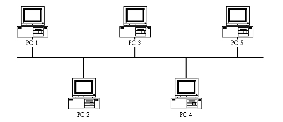
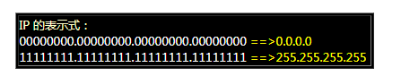
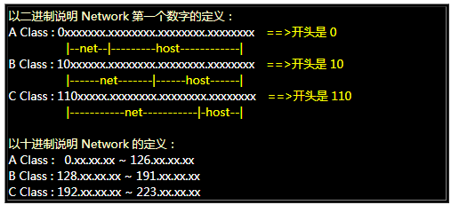
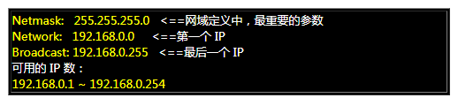

* OSI七层模型
  * 物理层
  * 数据链路层
  * 网络层
  * 传输层
  * 会话层
  * 表现层
  * 应用层

* __网络共享媒体__：单一时间点上面，只能由一部机器使用这个共享媒体
* __物理广播__：某一计算机在使用网络媒体发送数据前，需要发送数据报到其所在网络媒体上，通知其他计算机其即将使用网络媒体，其他计算机接到信息后会暂停自己的网络工作。
* 如果两台机器同时发送物理广播，则这两台机器发送的物理广播均无效。两台机器会在随后的一段时间内随机取时间再次发送物理广播。
* 网络媒体上在同一时间点只有一个数据报文在传输。
* __封包碰撞__：网络媒体上同时出现了两台机器传输的报文，封包碰撞会造成封包的损毁和丢失。使用CSMA/CD技术可以避免封包碰撞问题。
* __MAC__（Media-Access Control）地址是焊死在网卡上的，也被称为硬件地址（Hardware Address）。每个frame要传输出去，必须要以硬件地址为传输的来源与目标。
* 网络上使用IP来辨识计算机
* MAC的格式是6组16进制位数据组成，总共6bytes，基本格式为aa:bb:cc:dd:ee:ff
* __ARP协议__：主机的识别靠的是IP，而数据的传输靠的是MAC地址。IP与MAC有着一一对应的关系，管理这个关系的就是ARP协议。Linux主机中有一个ARP table记录着IP与MAC的对应信息。
* __逻辑广播__：找到IP与MAC的对应，逻辑广播是针对网络层的软件而言来进行的工作。
* 以PC1要传输数据给PC2为例：
  * PC1首次进行数据传输时，ARP table中没有数据，所以这时为了找到PC2的IP对应的MAC地址，PC1需要进行逻辑广播。PC1会发送一个带有自身的MAC地址与目的IP的逻辑广播封包给网络中的全部计算机，上图中的PC2~PC5都会收到这个广播封包。
  * PC2~PC5收到这个封包后，由于PC3~PC5均不是目的IP指向的主机，所以PC3~PC5收到这个封包后会将封包丢掉。而PC2收到逻辑广播的封包后，返现目的IP正是自己的IP，所以PC2就会发送一个回应封包给PC1，这个封包中就含有PC2自己的MAC地址。
  * PC1收到响应封包后，就知道了PC2的IP所对应的MAC地址了，此时PC1主机的ARP table就会将IP与MAC的对应写入表格中。知道了IP对应的MAC之后，PC1就可以向PC2传输数据了。
  * 未来，PC1想要再次传输数据给PC2时，就会先去自己的ARP table中查询是否有PC2主机对应的MAC地址，如果有则不会发布逻辑广播，直接依据ARP table中的信息来传输数据给PC2的网卡。
* ARP table中的数据是根据IP地址动态变化的。
* IP地址是一组32bits长度的数据，每8位一组，中间用点隔开。

* IP由两部分组成：HOST_ID和Net_ID，IP分为3类：

* 一个网域中，主机具有相同HOST_ID，但Net_ID各自不同
* __子网掩码Netmask__：用来协助切分子网。
* IP与Netmask做和操作可得Net_ID
* Netmask做非操作后的结果与IP再做和操作可得HOST_ID
* HOST_ID全部为0时的IP为该网段的Network，全部为1时，为该网段的Broadcast，所以在192.168.0.0~192.168.0.255这个IP网段中的相关网络参数有：

*  传输层常用协议：TCP、UDP、ICMP
* 路由：不同网域之间数据的传输需要通过路由。
* Gateway/Router：网关/路由器的功能就是在不同网域之间进行封包传递（IP Forward），由于路由器具有IP Forward的功能，并且具有管理路由的能力，所以可以将来自不同网域之间的封包进行传递。
* DNS：查询主机名对应的主机IP